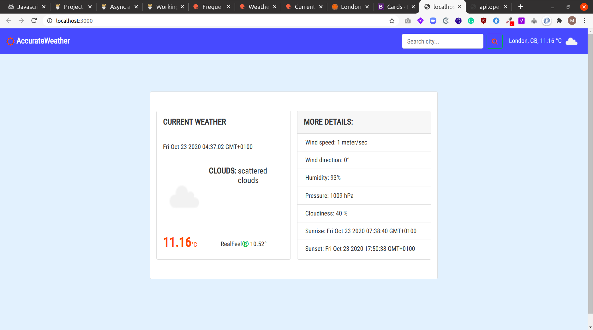

# weather-app

## Project description
This project is an implementation of a weather-app web page.

This project was done mainly for learning purposes, the aim was to practice using javascript asynchronous code and working with APIs. The project's specifications are listed on [The odin project](https://www.theodinproject.com/courses/javascript/lessons/weather-app)

## Screenshot

## Built with
- HTML5
- CSS3
- Vanilla Javascript
- Webpack js framework
- Javascript design patterns
- [Weather API](https://openweathermap.org/)

## Features
- This has a landing page, where users can access the app's features
- User can 
    - enter the name of a city and view the current weather
    - toggle the temperature units of measurement between degrees Centigrade and degrees Farenheight
    - view images/icons corresponding to the current weather

## Deployed Site
[Weather app on heroku](https://accurate-weather-app.herokuapp.com/)

## Running and testing it locally

### Prerequisites
- [NodeJS](https://nodejs.org/)
- [Yarn](https://yarnpkg.com/) or just the default npm which comes with NodeJS

### Setup
- Run `git clone https://github.com/bluette1/weather-app && cd weather-app` to get a copy of source codes on your local computer and to navigate inside the project directory
- Run `yarn install`
- Run `yarn build`

### Usage
- Run `yarn dev` to run this app in development environment or `yarn start` to run this project in production environment

### Tests
- No test yet

## Contributions

There are two ways of contributing to this project:

1.  If you see something wrong or not working, please check [the issue tracker section](https://github.com/bluette1/weather-app/issues), if that problem you met is not in already opened issues then open a new issue by clicking on `new issue` button.

2.  If you have a solution to that, and you are willing to work on it, follow the below steps to contribute:
    1.  Fork this repository
    1.  Clone it on your local computer by running `git clone https://github.com/your-username/weather-app.git` __Replace *your username* with the username you use on github__
    1.  Open the cloned repository which appears as a folder on your local computer with your favorite code editor
    1.  Create a separate branch off the *master branch*,
    1.  Write your codes which fix the issue you found
    1.  Commit and push the branch you created
    1.  Raise a pull request, comparing your new created branch with our original master branch [here](https://github.com/bluette1/weather-app)

## Author

👤 **Marylene Sawyer**
- Github: [@Bluette1](https://github.com/Bluette1)
- Twitter: [@MaryleneSawyer](https://twitter.com/MaryleneSawyer)
- Linkedin: [Marylene Sawyer](https://www.linkedin.com/in/marylene-sawyer)

## Show your support

Give a ⭐️ if you like this project!

## Acknowledgment
- [Microverse](https://www.microvese.org)
* [Webpack](https://webpack.js.org/)
- [Weather API](https://openweathermap.org/)

